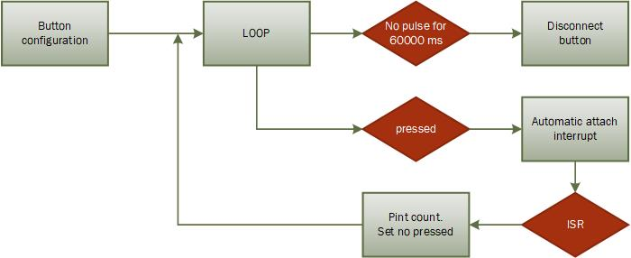
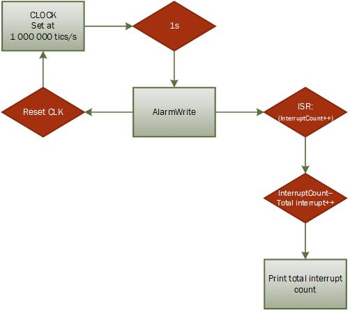

# PRACTICA 2  : INTERRUPCIONES

En esta practica realizamos dos tipos de interrupciones. 
La primera (A) controlada a través de un boton analógico y la segunda (B) por un contador de la micro. 

## A: Interrupción por botón

* CABEZERA 

En la cabezera encontramos la declaración de la estructura Button la cual guarda el numero del pin al cual este esta conectado, el numero de veces que se pulsó y su estado. 
Declaramos nuestro botón al pin 18 y el contador lo definimos a 0. 

```cpp
struct Button {
const uint8_t PIN;
uint32_t numberKeyPresses;
bool pressed;
};

Button button1 = {18, 0, false};
```
* ISR
Siguiente escribimos la funcion ISR que se ejecutará cuando la interrupción suceda. 
En este caso incrementa en uno el numero de pulsaciones del botón y cambia su estado a "pulsado".
```cpp
void IRAM_ATTR isr() {
button1.numberKeyPresses += 1;
button1.pressed = true;
}
```  
* SETUP
Empezamos el setup con el begin del puerto serie para mostrar resultados por pantalla. 
Después declaramos el pin deseado para la funcionalidad del botón.
Último utilizamos la funcion *attachInterrupt* para que ejecute el ISR cuando detecte una caída (pulsación) en el pin en el cual tenemos el boton conectado. 
```cpp
void setup() {

Serial.begin(9600);
pinMode(button1.PIN, INPUT_PULLUP);
attachInterrupt(button1.PIN, isr, FALLING);

}
```
* LOOP
Aquí regulamos la puslacion del boton. Cuando este esté pulsado imprimimos por pantalla el numero de veces que ha sido pulsado y lo configuramos a un estado de "no pulsado".

Finalmente hacemos que el boton se desactive tras 1 minuto de inactividad. 

```cpp
void loop() {

if (button1.pressed) {
Serial.printf("Button 1 has been pressed %u times\n", button1.numberKeyPresses);
button1.pressed = false;
}


//Detach Interrupt after 1 Minute
static uint32_t lastMillis = 0;
if (millis() - lastMillis > 60000) {
lastMillis = millis();
detachInterrupt(button1.PIN);
Serial.println("Interrupt Detached!");
}
}
``` 
### Diagrama de flujo A



## B: Interrupción por temporizador

* CABEZERA

Delcaramos las variables *interruptCounter* y *totalInterruptCounter*, la primera para manejar el contador internamente por si sucede alguna anomalia y el segundo para contar el nombre total de interrupciones des del inicio del programa. 

*hw_timer_t* declara un temporizador de hardware utilizado para las interrupciones. 

Se declara la variable timer de tipo *portMUX_TYPE* para sincronizar el loop principal y el ISR en el manejo de variables compartidas. 


```cpp
volatile int interruptCounter;

int totalInterruptCounter;

hw_timer_t * timer = NULL;

portMUX_TYPE timerMux = portMUX_INITIALIZER_UNLOCKED;
```

* ISR 

Contabiliza el nombre de interrupciones sucedidas.
Enta y sale del modo CRITICAl para evitar comportamientos erroneos. 

```cpp
void IRAM_ATTR onTimer() {
portENTER_CRITICAL_ISR(&timerMux);
interruptCounter++;
portEXIT_CRITICAL_ISR(&timerMux);
}
```

* SETUP

La placa ESP32 tiene un reloj que trabaja a 80Mhz, así pues lo deberemos ajustar al numero de tics desados en cada caso en el segundo parametro. Funciona de la siguente mantera: frequency(80Mhz)/escalado(2ndo parametro de la funcion timerBegin).
Inizializamos el contador (temporizador) y lo configuramos a 1000000 de tics por segundo. 
Utilizamos *timerAttachInterrupt* para detectar y ejecutar el ISR a cada salto de alarma.

La funcion *timerAlarmWrite* especifica en que punto del contador la interrupcion debe ser generada. Cuando el contador llegue a 1000000 de tics, saltará la alarma y sucederá la interrupción.*true* llama a reinicial el contador *timer* una vez esto haya ocurrido.  
Por último habilitamos el contador. 

```cpp
void setup() {

Serial.begin(9600);
timer = timerBegin(0, 80, true);
timerAttachInterrupt(timer, &onTimer, true);
timerAlarmWrite(timer, 1000000 , true);
timerAlarmEnable(timer);
}
```

* LOOP

En el loop es donde manipulamos la interrupción. 
Si el numero de interrupciones es mayor a 0 entonces el contador de interrupciones global se reduce para marcar que la interrupcion ha sido manipulada. Como la variable *interruptCounter* es compartida con el ISR y el *loop*, se ejecuta esta accion en el marco CRITICAL. 

Finalmente se incrementa el número de interrupciones sucedidas des de la ejecucción del programa y se muestran por pantalla. 

```cpp
void loop() {

if (interruptCounter > 0) {
portENTER_CRITICAL(&timerMux);
interruptCounter--;
portEXIT_CRITICAL(&timerMux);
totalInterruptCounter++;
Serial.print("An interrupt as occurred. Total number: ");
Serial.println(totalInterruptCounter);
}

}
```
### Diagrama de flujo B




## Referencia
https://github.com/PauAnton/Prac2.git


